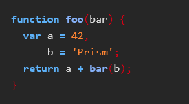
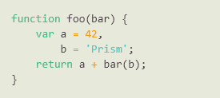
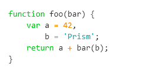
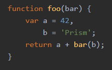
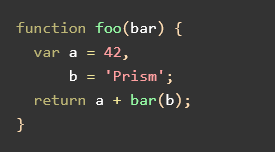
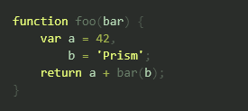

# Prism themes

This repository lists a selection of additional themes for the [Prism syntax highlighting library](http://prismjs.com/).

## How to use a theme

To use one of the themes, just include the theme's CSS file in your page. Example:

```html
<!DOCTYPE html>
<html>
    <head>
        ...
        <link href="themes/prism-ghcolors.css" rel="stylesheet" />
    </head>
    <body>
        ...
        <script src="prism.js"></script>
    </body>
</html>
```

## Adding a New Theme

See our [Contributing](CONTRIBUTING.md) guide.

## Available themes

* [__256-grayvim__](themes/prism-256-grayvim.css) (by [Andreas Mueller](webmaster@am-wd.de))<br />
[](themes/prism-256-grayvim.css)

* [__a11y Dark__](themes/prism-a11y-dark.css) (by [ericwbailey](https://github.com/ericwbailey))<br />
[](themes/prism-a11y-dark.css)

* [__Atom Dark__](themes/prism-atom-dark.css) (by [Joe Gibson](https://github.com/gibsjose), based on [Atom Dark Syntax theme](https://github.com/atom/atom-dark-syntax))<br />
[](themes/prism-atom-dark.css)

* [__Base16 Ashes Dark__](themes/prism-base16-ashes.dark.css) (by [Jannik Siebert](https://github.com/janniks), based on [Base16 color scheme](https://github.com/Base16 color scheme))<br />
[](themes/prism-base16-ashes.dark.css)

* [__Base16 Atelier Cave Dark__](themes/prism-base16-ateliercave.dark.css) (by [Bram de Haan](http://atelierbram.github.io/syntax-highlighting/atelier-schemes/cave), based on [Base16 color scheme](https://github.com/Base16 color scheme))<br />
[](themes/prism-base16-ateliercave.dark.css)

* [__Base16 Atelier Cave Light__](themes/prism-base16-ateliercave.light.css) (by [Bram de Haan](http://atelierbram.github.io/syntax-highlighting/atelier-schemes/cave), based on [Base16 color scheme](https://github.com/Base16 color scheme))<br />
[](themes/prism-base16-ateliercave.light.css)

* [__Base16 Atelier Dune Dark__](themes/prism-base16-atelierdune.dark.css) (by [Bram de Haan](http://atelierbram.github.io/syntax-highlighting/atelier-schemes/dune), based on [Base16 color scheme](https://github.com/Base16 color scheme))<br />
[](themes/prism-base16-atelierdune.dark.css)

* [__Base16 Atelier Dune Light__](themes/prism-base16-atelierdune.light.css) (by [Bram de Haan](http://atelierbram.github.io/syntax-highlighting/atelier-schemes/dune), based on [Base16 color scheme](https://github.com/Base16 color scheme))<br />
[](themes/prism-base16-atelierdune.light.css)

* [__Base16 Atelier Estuary Dark__](themes/prism-base16-atelierestuary.dark.css) (by [Bram de Haan](http://atelierbram.github.io/syntax-highlighting/atelier-schemes/estuary), based on [Base16 color scheme](https://github.com/Base16 color scheme))<br />
[](themes/prism-base16-atelierestuary.dark.css)

* [__Base16 Atelier Estuary Light__](themes/prism-base16-atelierestuary.light.css) (by [Bram de Haan](http://atelierbram.github.io/syntax-highlighting/atelier-schemes/estuary), based on [Base16 color scheme](https://github.com/Base16 color scheme))<br />
[](themes/prism-base16-atelierestuary.light.css)

* [__Base16 Atelier Forest Dark__](themes/prism-base16-atelierforest.dark.css) (by [Bram de Haan](http://atelierbram.github.io/syntax-highlighting/atelier-schemes/forest), based on [Base16 color scheme](https://github.com/Base16 color scheme))<br />
[](themes/prism-base16-atelierforest.dark.css)

* [__Base16 Atelier Forest Light__](themes/prism-base16-atelierforest.light.css) (by [Bram de Haan](http://atelierbram.github.io/syntax-highlighting/atelier-schemes/forest), based on [Base16 color scheme](https://github.com/Base16 color scheme))<br />
[](themes/prism-base16-atelierforest.light.css)

* [__Base16 Atelier Heath Dark__](themes/prism-base16-atelierheath.dark.css) (by [Bram de Haan](http://atelierbram.github.io/syntax-highlighting/atelier-schemes/heath), based on [Base16 color scheme](https://github.com/Base16 color scheme))<br />
[](themes/prism-base16-atelierheath.dark.css)

* [__Base16 Atelier Heath Light__](themes/prism-base16-atelierheath.light.css) (by [Bram de Haan](http://atelierbram.github.io/syntax-highlighting/atelier-schemes/heath), based on [Base16 color scheme](https://github.com/Base16 color scheme))<br />
[](themes/prism-base16-atelierheath.light.css)

* [__Base16 Atelier Lakeside Dark__](themes/prism-base16-atelierlakeside.dark.css) (by [Bram de Haan](http://atelierbram.github.io/syntax-highlighting/atelier-schemes/lakeside/), based on [Base16 color scheme](https://github.com/Base16 color scheme))<br />
[](themes/prism-base16-atelierlakeside.dark.css)

* [__Base16 Atelier Lakeside Light__](themes/prism-base16-atelierlakeside.light.css) (by [Bram de Haan](http://atelierbram.github.io/syntax-highlighting/atelier-schemes/lakeside/), based on [Base16 color scheme](https://github.com/Base16 color scheme))<br />
[](themes/prism-base16-atelierlakeside.light.css)

* [__Base16 Atelier Plateau Dark__](themes/prism-base16-atelierplateau.dark.css) (by [Bram de Haan](http://atelierbram.github.io/syntax-highlighting/atelier-schemes/plateau), based on [Base16 color scheme](https://github.com/Base16 color scheme))<br />
[](themes/prism-base16-atelierplateau.dark.css)

* [__Base16 Atelier Plateau Light__](themes/prism-base16-atelierplateau.light.css) (by [Bram de Haan](http://atelierbram.github.io/syntax-highlighting/atelier-schemes/plateau), based on [Base16 color scheme](https://github.com/Base16 color scheme))<br />
[](themes/prism-base16-atelierplateau.light.css)

* [__Base16 Atelier Savanna Dark__](themes/prism-base16-ateliersavanna.dark.css) (by [Bram de Haan](http://atelierbram.github.io/syntax-highlighting/atelier-schemes/savanna), based on [Base16 color scheme](https://github.com/Base16 color scheme))<br />
[](themes/prism-base16-ateliersavanna.dark.css)

* [__Base16 Atelier Savanna Light__](themes/prism-base16-ateliersavanna.light.css) (by [Bram de Haan](http://atelierbram.github.io/syntax-highlighting/atelier-schemes/savanna), based on [Base16 color scheme](https://github.com/Base16 color scheme))<br />
[](themes/prism-base16-ateliersavanna.light.css)

* [__Base16 Atelier Seaside Dark__](themes/prism-base16-atelierseaside.dark.css) (by [Bram de Haan](http://atelierbram.github.io/syntax-highlighting/atelier-schemes/seaside/), based on [Base16 color scheme](https://github.com/Base16 color scheme))<br />
[](themes/prism-base16-atelierseaside.dark.css)

* [__Base16 Atelier Seaside Light__](themes/prism-base16-atelierseaside.light.css) (by [Bram de Haan](http://atelierbram.github.io/syntax-highlighting/atelier-schemes/seaside/), based on [Base16 color scheme](https://github.com/Base16 color scheme))<br />
[](themes/prism-base16-atelierseaside.light.css)

* [__Base16 Atelier Sulphurpool Dark__](themes/prism-base16-ateliersulphurpool.dark.css) (by [Bram de Haan](http://atelierbram.github.io/syntax-highlighting/atelier-schemes/sulphurpool), based on [Base16 color scheme](https://github.com/Base16 color scheme))<br />
[](themes/prism-base16-ateliersulphurpool.dark.css)

* [__Base16 Atelier Sulphurpool Light__](themes/prism-base16-ateliersulphurpool.light.css) (by [Bram de Haan](http://atelierbram.github.io/syntax-highlighting/atelier-schemes/sulphurpool), based on [Base16 color scheme](https://github.com/Base16 color scheme))<br />
[](themes/prism-base16-ateliersulphurpool.light.css)

* [__Base16 Brewer Dark__](themes/prism-base16-brewer.dark.css) (by [Timothée Poisot](http://github.com/tpoisot), based on [Base16 color scheme](https://github.com/Base16 color scheme))<br />
[](themes/prism-base16-brewer.dark.css)

* [__Base16 Bright Dark__](themes/prism-base16-bright.dark.css) (by [Chris Kempson](http://chriskempson.com), based on [Base16 color scheme](https://github.com/Base16 color scheme))<br />
[](themes/prism-base16-bright.dark.css)

* [__Base16 Chalk Dark__](themes/prism-base16-chalk.dark.css) (by [Chris Kempson](http://chriskempson.com), based on [Base16 color scheme](https://github.com/Base16 color scheme))<br />
[](themes/prism-base16-chalk.dark.css)

* [__Base16 Google Light__](themes/prism-base16-google.light.css) (by [Seth Wright](http://sethawright.com), based on [Base16 color scheme](https://github.com/Base16 color scheme))<br />
[](themes/prism-base16-google.light.css)

* [__Base16 Grayscale Dark__](themes/prism-base16-grayscale.dark.css) (by [Alexandre Gavioli](https://github.com/Alexx2/), based on [Base16 color scheme](https://github.com/Base16 color scheme))<br />
[](themes/prism-base16-grayscale.dark.css)

* [__Base16 Grayscale Light__](themes/prism-base16-grayscale.light.css) (by [Alexandre Gavioli](https://github.com/Alexx2/), based on [Base16 color scheme](https://github.com/Base16 color scheme))<br />
[](themes/prism-base16-grayscale.light.css)

* [__Base16 Green Screen Dark__](themes/prism-base16-greenscreen.dark.css) (by [Chris Kempson](http://chriskempson.com), based on [Base16 color scheme](https://github.com/Base16 color scheme))<br />
[](themes/prism-base16-greenscreen.dark.css)

* [__Base16 harmonic16 Dark__](themes/prism-base16-harmonic16.dark.css) (by [Jannik Siebert](https://github.com/janniks), based on [Base16 color scheme](https://github.com/Base16 color scheme))<br />
[](themes/prism-base16-harmonic16.dark.css)

* [__Base16 Hopscotch Dark__](themes/prism-base16-hopscotch.dark.css) (by [Jan T. Sott](https://github.com/Jan T. Sott), based on [Base16 color scheme](https://github.com/Base16 color scheme))<br />
[](themes/prism-base16-hopscotch.dark.css)

* [__Base16 Isotope Dark__](themes/prism-base16-isotope.dark.css) (by [Jan T. Sott](https://github.com/Jan T. Sott), based on [Base16 color scheme](https://github.com/Base16 color scheme))<br />
[](themes/prism-base16-isotope.dark.css)

* [__Base16 Marrakesh Dark__](themes/prism-base16-marrakesh.dark.css) (by [Alexandre Gavioli](http://github.com/Alexx2/), based on [Base16 color scheme](https://github.com/Base16 color scheme))<br />
[](themes/prism-base16-marrakesh.dark.css)

* [__Base16 Marrakesh Light__](themes/prism-base16-marrakesh.light.css) (by [Alexandre Gavioli](http://github.com/Alexx2/), based on [Base16 color scheme](https://github.com/Base16 color scheme))<br />
[](themes/prism-base16-marrakesh.light.css)

* [__Base16 Mocha Dark__](themes/prism-base16-mocha.dark.css) (by [Chris Kempson](http://chriskempson.com), based on [Base16 color scheme](https://github.com/Base16 color scheme))<br />
[](themes/prism-base16-mocha.dark.css)

* [__Base16 Monokai Dark__](themes/prism-base16-monokai.dark.css) (by [Wimer Hazenberg](http://www.monokai.nl), based on [Base16 color scheme](https://github.com/Base16 color scheme))<br />
[](themes/prism-base16-monokai.dark.css)

* [__Base16 Ocean Dark__](themes/prism-base16-ocean.dark.css) (by [Chris Kempson](http://chriskempson.com), based on [Base16 color scheme](https://github.com/Base16 color scheme))<br />
[](themes/prism-base16-ocean.dark.css)

* [__Base16 Paraiso Dark__](themes/prism-base16-paraiso.dark.css) (by [Jan T. Sott](https://github.com/Jan T. Sott), based on [Base16 color scheme](https://github.com/Base16 color scheme))<br />
[](themes/prism-base16-paraiso.dark.css)

* [__Base16 Paraiso Light__](themes/prism-base16-paraiso.light.css) (by [Jan T. Sott](https://github.com/Jan T. Sott), based on [Base16 color scheme](https://github.com/Base16 color scheme))<br />
[](themes/prism-base16-paraiso.light.css)

* [__Base16 Railscasts Dark__](themes/prism-base16-railscasts.dark.css) (by [Ryan Bates](http://railscasts.com), based on [Base16 color scheme](https://github.com/Base16 color scheme))<br />
[](themes/prism-base16-railscasts.dark.css)

* [__Base16 Solarized Dark__](themes/prism-base16-solarized.dark.css) (by [Ethan Schoonover](http://ethanschoonover.com/solarized), based on [Base16 color scheme](https://github.com/Base16 color scheme))<br />
[](themes/prism-base16-solarized.dark.css)

* [__Base16 Solarized Light__](themes/prism-base16-solarized.light.css) (by [Ethan Schoonover](http://ethanschoonover.com/solarized), based on [Base16 color scheme](https://github.com/Base16 color scheme))<br />
[](themes/prism-base16-solarized.light.css)

* [__Base16 Summerfruit Dark__](themes/prism-base16-summerfruit.dark.css) (by [Christopher Corley](http://cscorley.github.io/), based on [Base16 color scheme](https://github.com/Base16 color scheme))<br />
[](themes/prism-base16-summerfruit.dark.css)

* [__Base16 Summerfruit Light__](themes/prism-base16-summerfruit.light.css) (by [Christopher Corley](http://cscorley.github.io/), based on [Base16 color scheme](https://github.com/Base16 color scheme))<br />
[](themes/prism-base16-summerfruit.light.css)

* [__Base16 Tomorrow Dark__](themes/prism-base16-tomorrow.dark.css) (by [Chris Kempson](http://chriskempson.com), based on [Base16 color scheme](https://github.com/Base16 color scheme))<br />
[](themes/prism-base16-tomorrow.dark.css)

* [__Base16 Twilight Dark__](themes/prism-base16-twilight.dark.css) (by [David Hart](http://hart-dev.com), based on [Base16 color scheme](https://github.com/Base16 color scheme))<br />
[](themes/prism-base16-twilight.dark.css)

* [__CB__](themes/prism-cb.css) (by [atelierbram](https://github.com/atelierbram), based on [Syntax Highlighter CB Plugin](https://github.com/Syntax Highlighter CB Plugin))<br />
[](themes/prism-cb.css)

* [__Coy without shadows__](themes/prism-coy-without-shadows.css) (by [RunDevelopment](https://github.com/RunDevelopment), based on [Coy theme for prism.js](https://github.com/Coy theme for prism.js))<br />
[](themes/prism-coy-without-shadows.css)

* [__Darcula__](themes/prism-darcula.css) (by [Alexandre Paradis](service.paradis@gmail.com), based on [Jetbrain's IntelliJ Darcula Theme](https://github.com/bulenkov/Darcula))<br />
[](themes/prism-darcula.css)

* [__desert__](themes/prism-desert.css) (by [Andreas Mueller](webmaster@am-wd.de))<br />
[](themes/prism-desert.css)

* [__Dracula__](themes/prism-dracula.css) (originally by [Zeno Rocha](https://github.com/zenorocha), adapted by [Albert Vallverdu](https://github.com/byverdu))<br />
[](themes/prism-dracula.css)

* [__Duotone Dark__](themes/prism-duotone-dark.css) (by [Simurai](https://github.com/simurai), based on [Duotone Dark Syntax theme for Atom](https://github.com/simurai/duotone-dark-syntax))<br />
[](themes/prism-duotone-dark.css)

* [__Duotone Earth__](themes/prism-duotone-earth.css) (by [Simurai](https://github.com/simurai), based on [DuoTone Dark Earth Syntax theme for Atom](https://github.com/simurai/duotone-dark-earth-syntax))<br />
[](themes/prism-duotone-earth.css)

* [__Duotone Forest__](themes/prism-duotone-forest.css) (by [Simurai](https://github.com/simurai), based on [DuoTone Dark Forest Syntax theme for Atom](https://github.com/simurai/duotone-dark-forest-syntax))<br />
[](themes/prism-duotone-forest.css)

* [__Duotone Light__](themes/prism-duotone-light.css) (by [Simurai](https://github.com/simurai), based on [DuoTone Light Syntax theme](https://github.com/simurai/duotone-light-syntax))<br />
[](themes/prism-duotone-light.css)

* [__Duotone Sea__](themes/prism-duotone-sea.css) (by [Simurai](https://github.com/simurai), based on [DuoTone Dark Sea Syntax theme for Atom](https://github.com/simurai/duotone-dark-sea-syntax))<br />
[](themes/prism-duotone-sea.css)

* [__Duotone Space__](themes/prism-duotone-space.css) (by [Simurai](https://github.com/simurai), based on [DuoTone Dark Space Syntax theme for Atom](https://github.com/simurai/duotone-dark-space-syntax))<br />
[](themes/prism-duotone-space.css)

* [__EA__](themes/prism-ea.css) (by [Jan T. Sott](https://github.com/Jan T. Sott), based on [Hopscotch](https://github.com/Hopscotch))<br />
[](themes/prism-ea.css)

* [__Eclipse__](themes/prism-eclipse.css) (by [Andreas Mueller](webmaster@am-wd.de))<br />
[](themes/prism-eclipse.css)

* [__GHColors__](themes/prism-ghcolors.css) (by [Avi Aryan](http://aviaryan.in), based on [Github syntax coloring](https://github.com/Github syntax coloring))<br />
[](themes/prism-ghcolors.css)

* [__Hopscotch__](themes/prism-hopscotch.css) (by [Jan T. Sott](https://github.com/idleberg))<br />
[](themes/prism-hopscotch.css)

* [__Material Dark__](themes/prism-material-dark.css) (by [dutchenkoOleg](https://github.com/dutchenkoOleg))<br />
[](themes/prism-material-dark.css)

* [__Material Light__](themes/prism-material-light.css) (by [dutchenkoOleg](https://github.com/dutchenkoOleg))<br />
[](themes/prism-material-light.css)

* [__Material Oceanic__](themes/prism-material-oceanic.css) (by [dutchenkoOleg](https://github.com/dutchenkoOleg))<br />
[](themes/prism-material-oceanic.css)

* [__Monokai__](themes/prism-monokai.css) (by [Andreas Mueller](webmaster@am-wd.de))<br />
[](themes/prism-monokai.css)

* [__Nord__](themes/prism-nord.css) (originally by [Arctic Ice Studio](https://github.com/Arctic Ice Studio), adapted by [Zane Hitchcoxc (@zwhitchcox) and Gabriel Ramos](https://github.com/gabrieluizramos))<br />
[](themes/prism-nord.css)

* [__prism.js tomorrow night eighties for JavaScript, CoffeeScript, CSS and HTML__](themes/prism-nova.css) (by [Rose Pritchard](https://github.com/Rose Pritchard))<br />
[](themes/prism-nova.css)

* [__obsidian2__](themes/prism-obsidian2.css) (by [Andreas Mueller](webmaster@am-wd.de))<br />
[](themes/prism-obsidian2.css)

* [__Panda Syntax__](themes/prism-panda.css) (by [Siamak Mokhtari](http://github.com/siamak/))<br />
[](themes/prism-panda.css)

* [__Panda__](themes/prism-panda2.css) (by [Javid Izadfar](https://github.com/Javid-Izadfar))<br />
[](themes/prism-panda2.css)

* [__Pojoaque__](themes/prism-pojoaque.css) (originally by [Jason Tate](http://web-cms-designs.com/ftopict-10-pojoaque-style-for-highlight-js-code-highlighter.html), adapted by [atelierbram](https://github.com/atelierbram))<br />
[](themes/prism-pojoaque.css)

* [__Shades of Purple__](themes/prism-shades-of-purple.css) (by [Ahmad Awais](https://github.com/ahmadawais))<br />
[](themes/prism-shades-of-purple.css)

* [__Synthwave '84__](themes/prism-synthwave84.css) (originally by [Robb Owen](https://github.com/Robb0wen), adapted by [Marc Backes](https://github.com/themarcba))<br />
[](themes/prism-synthwave84.css)

* [__VS__](themes/prism-vs.css) (by [Andrew Lock](https://andrewlock.net), based on [Visual Studio syntax coloring](https://github.com/Visual Studio syntax coloring))<br />
[](themes/prism-vs.css)

* [__VSC Dark Plus__](themes/prism-vsc-dark-plus.css) (by [Taylor Buckner](https://github.com/tabuckner), based on [VS Codes Dark+](https://github.com/VS Codes Dark+))<br />
[](themes/prism-vsc-dark-plus.css)

* [__Xonokai__](themes/prism-xonokai.css) (by [atelierbram](https://github.com/atelierbram), based on [https://github.com/MoOx/sass-prism-theme-base by Maxime Thirouin ~ MoOx --> http://moox.fr/ , which is Loosely based on Monokai textmate theme](https://github.com/https://github.com/MoOx/sass-prism-theme-base by Maxime Thirouin ~ MoOx --> http://moox.fr/ , which is Loosely based on Monokai textmate theme))<br />
[](themes/prism-xonokai.css)

* [__Zenburn__](themes/prism-zenburn.css) (by [Andreas Mueller](webmaster@am-wd.de))<br />
[](themes/prism-zenburn.css)
